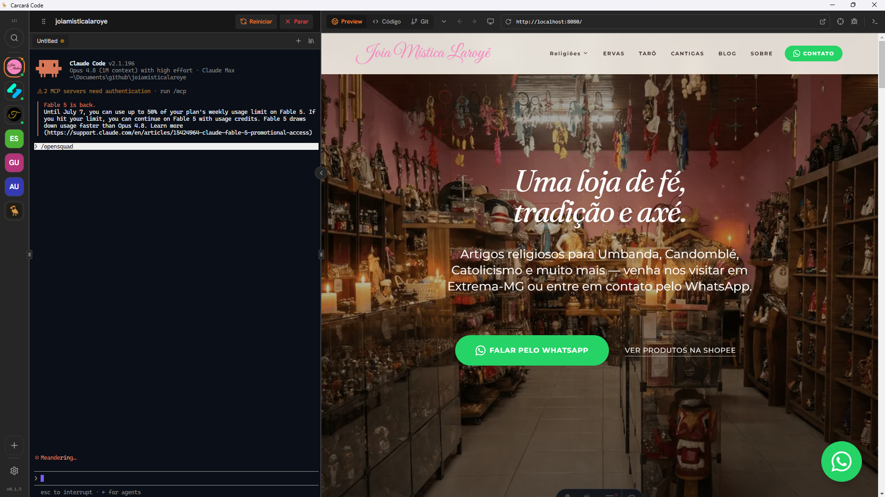
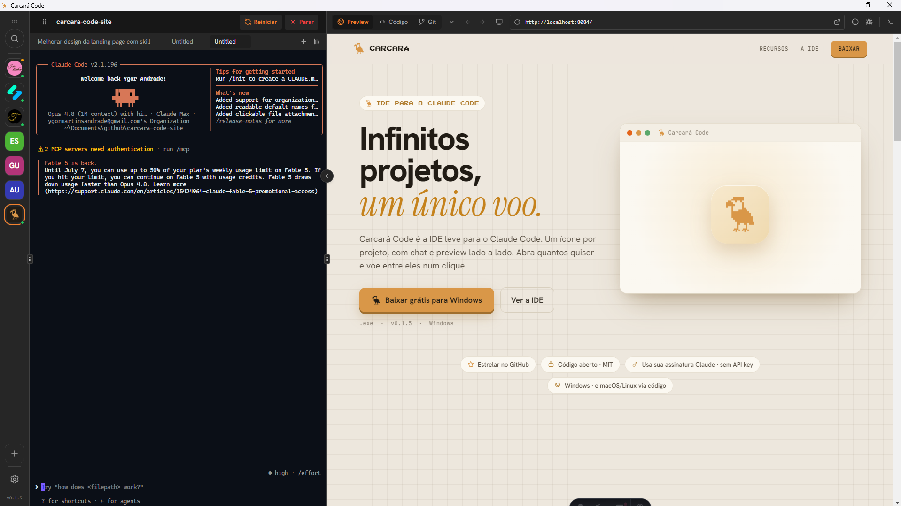
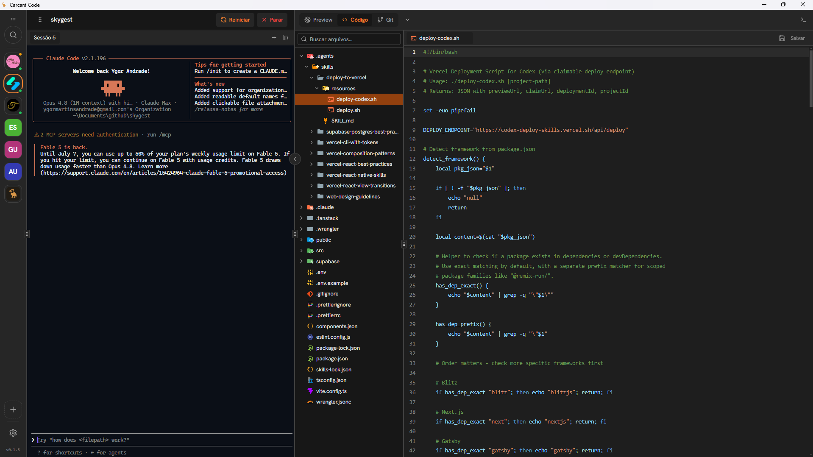
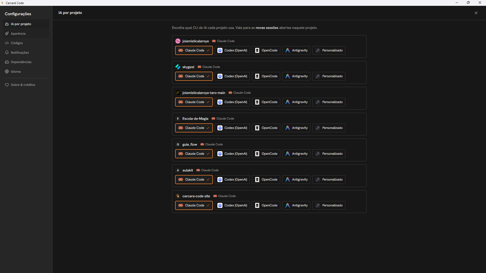

<p align="center">
  
</p>

<h1 align="center">Carcará Code</h1>

<p align="center">
  <strong>Infinitos projetos, um único voo.</strong><br>
  IDE minimalista para o <a href="https://claude.ai/code">Claude Code</a> (ou qualquer IA com CLI). Um ícone por projeto, chat e preview lado a lado.
</p>

<p align="center">
  <a href="../../releases"></a>
  <a href="LICENSE"></a>
  
  
  <a href="../../stargazers"></a>
</p>

<p align="center">
  
</p>

---

## O que é

Eu costumo tocar vários projetos ao mesmo tempo, e trabalhar com IA nisso virava um caos de janelas: uma instância do VS Code por projeto, um terminal em cada, o preview no navegador, o Git noutro canto.

O **Carcará Code** junta tudo num lugar só. Três painéis, zero firula:

1. **Rail** — um ícone por projeto (varre a sua pasta raiz). Cada ícone tem a sua sessão de IA viva; dá pra ter o Claude trabalhando em três projetos em paralelo e voar entre eles num clique.
2. **Chat** — conversa com o Claude Code naquele projeto (usa a **sua assinatura**, não a API: não precisa de API key e a conta não passa por ninguém).
3. **Preview** — detecta o script `dev`/`start`, sobe o servidor e mostra o site embutido. Se já estiver rodando, não sobe de novo.

## Recursos

**Preview automático ao selecionar o projeto**

Clicou no ícone, o preview sobe sozinho. Chat de um lado, site do outro, e a mudança aparece na hora.



**Editor de código com árvore de arquivos**

Quando precisa pôr a mão no código, o editor (CodeMirror) e a árvore de arquivos estão ali, sem trocar de janela.



**Qualquer IA com CLI, por projeto**

Cada projeto escolhe qual CLI usar: Claude Code, Codex, OpenCode, Antigravity ou um comando personalizado.



**E ainda:** chamadas de API (aba REST), conexão MCP, subir pro GitHub e checkpoints para "voltar no tempo" — sem sujar o Git do seu projeto (o histórico vive num repositório-sombra separado).

## Baixar (Windows)

Pegue o instalador mais recente na página de **[Releases](../../releases)**. Baixe o `CarcaraCode-Setup-*.exe`, execute e pronto.

> Na primeira execução o Windows pode mostrar um aviso do SmartScreen ("O Windows protegeu seu PC"), porque o instalador ainda não é assinado. Clique em **Mais informações → Executar assim mesmo**. É seguro — o código é aberto, dá pra auditar tudo aqui.

## Como rodar (a partir do código)

```bash
npm install
npm start
```

Na primeira vez, clique no **+** do rail pra escolher a pasta onde ficam seus projetos (padrão: `~/Documents/github`). Cada subpasta vira um ícone.

## Requisitos

- **Node.js** instalado.
- **Claude Code** instalado e logado (`claude` no terminal funcionando) — o chat usa a mesma autenticação.

## Notas (MVP)

- O chat roda em modo `bypassPermissions` pra ter o fluxo "Lovable" (sem pedir confirmação a cada passo).
- O preview detecta a porta lendo a saída do dev server (`http://localhost:PORT`).
- Estado por projeto (chat/preview) vive em memória enquanto o app está aberto.
- Se for abrir de dentro de um terminal do Claude Code, limpe `ELECTRON_RUN_AS_NODE` antes (`$env:ELECTRON_RUN_AS_NODE=$null; npm start`) — essa variável faz o Electron rodar como Node puro. Num terminal normal não precisa.

## Como contribuir

Toda ajuda é bem-vinda — bug, ideia, tradução, ou código.

1. Abra uma **[issue](../../issues)** descrevendo o bug ou a ideia (ou pegue uma que já exista).
2. Faça um **fork**, crie uma branch (`git checkout -b minha-melhoria`).
3. Rode local com `npm install && npm start` pra testar.
4. Lembre: edições em `src/` só aparecem depois de `npm run build` (o app carrega de `dist/`).
5. Abra um **pull request** explicando o que mudou e por quê.

Não precisa ser perfeito — PRs pequenos e focados são os mais fáceis de revisar e aceitar.

## Stack

Electron + React + Vite, CodeMirror (editor), xterm + node-pty (terminal), Tailwind. O chat conversa com o **Claude Code** que você já tem instalado.

## Licença

[MIT](LICENSE) © Ygor Andrade — use, modifique e distribua à vontade.
