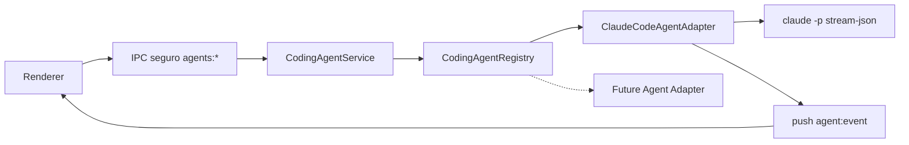

# Arquitetura da camada de Coding Agents

> Data: 2026-07-12 · Código: `electron/agents/` · Contratos de referência:
> `docs/contracts/loop-code-contracts.ts`

## 1. Problema resolvido

O app executava agentes de IA por dois caminhos acoplados à UI: o terminal PTY
(`term:*`, CLI interativa) e a ponte de chat (`chat:*`, `claude -p` headless).
Nenhum deles servia como **API programática** para o futuro motor de Coding
Loops — que precisa de "1 prompt → 1 execução → 1 resultado estruturado", com
eventos, cancelamento e resultado agregado (custo, sessão, saída), e **sem
depender de um agente específico**.

A camada `electron/agents/` cria esse contrato genérico e encapsula a
integração existente do Claude Code nele, sem tocar no comportamento do chat e
do terminal (continuam funcionando exatamente como antes).

## 2. Arquitetura

```text
electron/agents/
├── agent-errors.cjs          # erros de domínio (NotFound, Unavailable, Execution, Cancellation)
├── agent-types.cjs           # typedefs JSDoc + validateExecutionInput + makeEvent
├── agent-registry.cjs        # CodingAgentRegistry (register/get/list)
├── agent-service.cjs         # CodingAgentService (listAgents/execute/cancel/disposeAll)
├── claude-code-adapter.cjs   # primeira implementação do contrato
├── index.cjs                 # createAgentRuntime() — monta registry+service com deps reais
└── *.test.js                 # vitest (31 testes, sem CLI real — deps injetadas)
```

Padrão do projeto respeitado: módulos `.cjs` com lógica pura/testável e
dependências com efeito (spawn, kill, env, probe) **injetáveis**; os efeitos
reais entram só no `main.js`.



## 3. Contrato do adapter

```js
adapter = {
  descriptor: {
    id: 'claude-code',            // id canônico
    name: 'Claude Code',
    description,
    executable: 'claude',
    supportsStreaming: true,
    supportsSessionResume: true,
    supportsCancellation: true,
  },
  checkAvailability(): Promise<{ available, version?, reason? }>,
  execute(input, onEvent?): Promise<AgentExecutionResult>,
  cancel(executionId): Promise<void>,
  activeExecutions(): string[],
  disposeAll(): Promise<void>,
}
```

- `AgentExecutionInput`: `executionId`, `workspacePath`, `prompt` e opcionais
  `sessionId` (resume), `model`, `permissionMode`, `metadata`. Validado por
  `validateExecutionInput` (campos desconhecidos são descartados).
- `AgentExecutionResult`: `status` (`completed`/`failed`/`cancelled`),
  `sessionId`, `exitCode`, `output`, `errorOutput` (stderr limitado a 16 KB),
  `usage` (`costUsd`/`durationMs`/`numTurns`), `startedAt`/`finishedAt`,
  `error` (`{ code, message }` legível — sem stack trace pra UI).
- **`execute` sempre resolve** com um resultado (mesmo em falha/cancelamento);
  só **lança** para erro de chamada: agente inexistente, input inválido ou
  `executionId` duplicado.

Ids canônicos ≠ ids legados das CLIs (`ai-cli.cjs`: 'claude', 'codex'…). O mapa
`LEGACY_CLI_TO_AGENT_ID` em `agent-types.cjs` faz a ponte sem tocar no config
existente.

## 4. Registro de agentes

`CodingAgentRegistry` — mapa id→adapter com `register` (rejeita duplicado),
`get` (lança `CodingAgentNotFoundError`), `has` e `list`. Os adapters reais são
registrados em **um único lugar**: `createAgentRuntime()` (`index.cjs`).

## 5. Serviço

`CodingAgentService` centraliza as operações e o **rastreamento de execuções
ativas** (`executionId → { agentId, workspacePath, startedAt }`):

- `listAgents()` → `[{ descriptor, availability }]`; exceção de disponibilidade
  vira `{ available: false, reason }` (a UI mostra "não instalado", nunca stack).
- `execute(agentId, input, onEvent)` → valida input, impede `executionId`
  duplicado, delega ao adapter e limpa o rastreamento ao final.
- `cancel(agentId, executionId)` → só cancela se a execução **pertence àquele
  agente** (impede cancelamento cruzado).
- `disposeAll()` → shutdown (chamado no `cleanup()` do app).
- `defaultAgentId` → **`'claude-code'`** (agente padrão; nada exige
  configuração manual — quem funcionava antes continua funcionando).

## 6. Fluxo de execução

1. Renderer chama `window.api.agentsExecute(agentId, input)`.
2. Handler `agents:execute` (main.js): valida shape, checa
   `isAuthorizedWorkspace(input.workspacePath)` — o caminho precisa estar na
   lista de projetos do rail (realpath, local, sem `ssh://`).
3. `CodingAgentService.execute` → `ClaudeCodeAgentAdapter.execute`.
4. O adapter spawna **um processo por execução**:
   `claude -p --input-format stream-json --output-format stream-json --verbose`
   (+ `--resume`/`--model`/`--permission-mode` quando informados), com
   `cwd = workspace`, env limpo (sem `ANTHROPIC_API_KEY`/`ANTHROPIC_AUTH_TOKEN`/
   `ELECTRON_RUN_AS_NODE`), `shell: true` **só no Windows** (resolução do
   binário no PATH) e argumentos **sempre em array**.
5. Escreve a mensagem do usuário no stdin (formato `stream-json` de
   `chat-cli.cjs#buildUserMessage`) e **fecha o stdin** — o processo conclui o
   turno e sai (diferente do chat persistente).
6. stdout linha a linha → `chat-cli.cjs#normalizeStreamEvent` → eventos.
7. `close` → resultado agregado (status, output do evento `result`, usage).

## 7. Eventos (streaming)

Push IPC único **`agent:event`** (mesmo padrão de `chat:event`), payload
`{ agentId, event }` com `event.type`:

| type                  | payload extra                                                                             |
| --------------------- | ----------------------------------------------------------------------------------------- |
| `execution-started`   | —                                                                                         |
| `session-created`     | `sessionId` (primeira vez que o stream revela a sessão)                                   |
| `agent-message`       | `event` normalizado da CLI (`text`/`thinking`/`tool_use`/`tool_result`/`system`/`result`) |
| `stderr`              | `content`                                                                                 |
| `execution-completed` | `exitCode`                                                                                |
| `execution-failed`    | `message`                                                                                 |
| `execution-cancelled` | —                                                                                         |

Todos carregam `executionId` e `timestamp` ISO. O renderer assina com o
`window.api.on('agent:event', cb)` existente (com cleanup de listener).

## 8. Cancelamento e processos

- `agents:cancel` → service (valida dono) → adapter marca `cancelled` e mata o
  processo via `killProc` do main (no Windows, `taskkill /t` mata a árvore).
- O desfecho chega pelo `close` do processo → `status: 'cancelled'`.
- `cleanup()` do app chama `service.disposeAll()` — nenhum processo órfão ao
  fechar a janela.
- IDs duplicados são rejeitados no service **e** o adapter mantém seu próprio
  mapa (defesa em profundidade).

## 9. Sessões e persistência

- `resume`: `input.sessionId` → `--resume` na CLI; o `sessionId` novo/atual
  volta no resultado e no evento `session-created`. O chamador (futuro
  LoopRunner) decide guardar e reutilizar.
- A camada **não persiste nada** por enquanto (sem estado em disco). As
  sessões do chat (`claude-sessions.cjs`) continuam independentes.

## 10. IPC e segurança

- Canais: `agents:list`, `agents:execute`, `agents:cancel` + push `agent:event`.
- Preload expõe só três métodos (`agentsList`, `agentsExecute`, `agentsCancel`);
  **nenhum acesso a `child_process`/Node no renderer**.
- Validações no main: shape do payload, `validateExecutionInput`,
  `isAuthorizedWorkspace` (nada de executar em caminho arbitrário).
- Sem `shell: true` fora do Windows; prompt vai por **stdin**, nunca
  concatenado em string de shell; argumentos em array.
- Segredos: env limpo remove as chaves da Anthropic; nada de token em log ou
  evento; erros para a UI são mensagens curtas (detalhe técnico fica no
  `details` interno).

## 11. Como adicionar um novo agente

1. Crie `electron/agents/<nome>-adapter.cjs` implementando o contrato (use o
   Claude como molde; deps injetáveis).
2. Registre em `createAgentRuntime()` (`electron/agents/index.cjs`).
3. Adicione testes com processo falso (ver `claude-code-adapter.test.js`).
4. Pronto — `agents:list` passa a devolvê-lo com disponibilidade real. **Não
   registre um agente sem implementação funcional** (a UI o mostraria como
   utilizável).

Exemplo (apenas documentação):

```typescript
export class CustomCliAgentAdapter implements CodingAgentAdapter {
  readonly descriptor = {
    id: 'custom',
    name: 'Custom CLI',
    supportsStreaming: false,
    supportsSessionResume: false,
    supportsCancellation: true,
  };
  async checkAvailability() {
    /* spawnSync('<bin>', ['--version']) */
  }
  async execute(input: AgentExecutionInput) {
    /* spawn com args em array, cwd = workspace */
  }
  async cancel(executionId: string) {
    /* killProc */
  }
}
```

## 12. Limitações atuais

- Só o **Claude Code** está registrado (decisão desta etapa: nenhuma integração
  falsa). Codex/Gemini/OpenCode/custom entram nas próximas fases.
- A UI ainda não consome `agents:*` — a seleção de CLI por projeto/sessão
  continua pelo fluxo existente (`AiPicker`/`ai:*`), que já cobre a
  necessidade atual. UI dedicada (status/execuções) vem com o painel do Loop.
- Execução única por chamada (sem fila/paralelismo — proibido nesta etapa).
- `permissionMode` é repassado à CLI; **não há default oculto** de
  `bypassPermissions` na camada nova.
- Workspaces remotos (`ssh://`) não são aceitos pelo caminho `agents:*` ainda.
