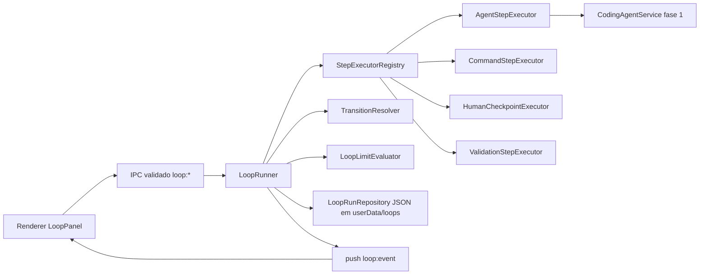

# Coding Loop Engine

> Data: 2026-07-12 · Código: `electron/loop/` · Fase 2 do plano de migração.

## Objetivo

Executar tarefas de engenharia em **ciclos controlados** (planejar → aprovar →
implementar → validar → corrigir ou concluir), onde **o motor decide o
workflow** — nunca o agente. O agente executa UMA etapa e devolve o resultado;
estado, transições, iterações, limites, checkpoints, cancelamento e retomada
são responsabilidade do `LoopRunner` no processo main.

## Arquitetura



| Componente              | Arquivo                                   | Papel                                                                                                                        |
| ----------------------- | ----------------------------------------- | ---------------------------------------------------------------------------------------------------------------------------- |
| LoopRunner              | `loop-runner.cjs` (`createLoopRunner`)    | máquina de estados: dirige etapas, persiste antes/depois, resolve transições, pausa em checkpoint, cancela, retoma, finaliza |
| StepExecutorRegistry    | `step-executor-registry.cjs`              | executores por tipo; sem switch gigante no runner                                                                            |
| AgentStepExecutor       | `executors/agent-step-executor.cjs`       | roda o coding agent pela abstração da Fase 1 (qualquer adapter)                                                              |
| CommandStepExecutor     | `executors/command-step-executor.cjs`     | processos locais seguros (executable + args, timeout, cancel)                                                                |
| HumanCheckpointExecutor | `executors/human-checkpoint-executor.cjs` | pausa persistida; decisão por operação separada                                                                              |
| ValidationStepExecutor  | `executors/validation-step-executor.cjs`  | evidências determinísticas (arquivos, exit codes)                                                                            |
| TransitionResolver      | `transition-resolver.cjs`                 | condição → próxima etapa ou estado terminal                                                                                  |
| LoopLimitEvaluator      | `limit-evaluator.cjs`                     | iterações, duração, execuções de agente/comando                                                                              |
| LoopRunRepository       | `loop-run-repository.cjs`                 | um JSON por run, escrita atômica                                                                                             |
| LoopPromptBuilder       | `loop-prompt-builder.cjs`                 | prompt da etapa (objetivo + papel + feedback da última falha)                                                                |
| Definition validator    | `definition-validator.cjs`                | recusa definições inválidas com mensagens claras                                                                             |
| Templates               | `templates.cjs`                           | Feature Development e Bug Fix                                                                                                |
| Runtime/wiring          | `index.cjs` (`createLoopRuntime`)         | monta tudo com deps reais no main.js                                                                                         |

Padrão do projeto respeitado: módulos `.cjs` puros com dependências (spawn,
kill, env, fs, agentes) **injetáveis** — os 83 testes do motor rodam sem
Electron, sem CLI de IA e sem rede.

## Fluxo por etapa

```text
carregar run → avaliar limites → criar stepRun (running) → PERSISTIR
→ executor.execute(input, AbortSignal) → aplicar resultado → PERSISTIR
→ TransitionResolver(condição) → próxima etapa | terminal | checkpoint
```

- Cada `stepRun` grava: id, stepId, tipo, status, tentativa, início/fim,
  resumo, stdout/stderr **truncados** (16 KB, mantendo o final), exit code,
  sessão do agente, resultado de validação, decisão de transição.
- Condição sem transição correspondente → `failed` controlado (nunca avanço
  silencioso).

## Limites

Avaliados ANTES de cada etapa (`limit-evaluator.cjs`): `maxIterations`
(iteração = transição de volta/back-edge — uma volta completa conta 1),
`maxDurationMs`, `maxAgentExecutions`, `maxCommandExecutions`. Ao atingir:
`status = limit_reached` com `{ limite, atual, máximo, etapa }` gravados no
run — e o loop **não continua** (terminal).

## Cancelamento

`cancelRun(runId)`: aborta o `AbortController` da etapa corrente (agente é
cancelado via `CodingAgentService.cancel`; comando é morto via `killProc` —
árvore inteira no Windows), o drive finaliza como `cancelled`, persiste e
emite `loop-cancelled`. Histórico preservado. Em checkpoint/interrompido (sem
etapa ativa) finaliza direto. No fechamento do app, `disposeAll()` aborta tudo
e a recuperação do próximo boot marca os runs como interrompidos.

## Eventos

Push IPC único `loop:event`: `loop-started`, `step-started`, `step-output`
(`stdout`/`stderr`/`agent`, em streaming), `step-completed`, `step-failed`,
`approval-required`, `loop-completed`, `loop-failed`, `loop-cancelled`,
`loop-blocked`, `loop-limit-reached` — todos com `runId` e `timestamp` ISO. O
renderer assina com `window.api.on('loop:event', cb)` (com cleanup).

## Persistência

`userData/loops/<runId>.json` (escrita atômica tmp+rename). Persistidos:
definição usada (retomada não depende do template mudar), estado, etapa
corrente, stepRuns resumidos, iterações, contadores, timestamps, checkpoints
com decisão, erros, objetivo, workspace. **Nunca**: tokens, secrets, env,
stdout ilimitado. `runId` validado contra path traversal.

## Recuperação e retomada

No boot, `recoverOnStartup()`: runs `running` órfãos ganham `interrupted: true`
e a etapa que estava rodando vira `failed` ("interrompida") — **nada é retomado
sozinho e nada assume sucesso**. O usuário retoma com `resumeRun(runId)`
(repete a etapa corrente como nova tentativa) ou `retryStep(runId, stepId)`.
Checkpoints aguardando aprovação são preservados como estão. Estados terminais
nunca são retomados.
