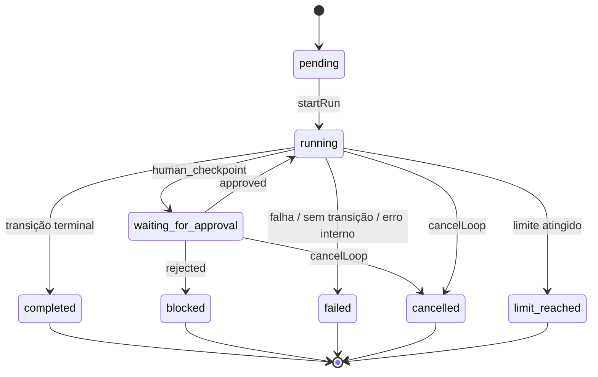

# Coding Loop — Ciclo de vida da execução

## Estados do run

**Terminais (imutáveis):** `completed`, `blocked`, `failed`, `cancelled`,
`limit_reached`. Qualquer operação sobre um run terminal falha com
`CodingLoopInvalidStateError` — continuar exige criar uma NOVA execução.

## Estados de etapa (stepRun)

`pending* → running → passed | failed | waiting_for_approval | cancelled`
(`skipped` reservado; \*etapas nascem `running` porque o stepRun só é criado
no momento de executar — o histórico completo fica em `run.stepRuns`, uma
entrada por tentativa com o campo `attempt`).

## Checkpoints humanos

1. O executor devolve `waiting_for_approval` — **não** fica com Promise aberta.
2. O runner grava o checkpoint no stepRun, muda o run para
   `waiting_for_approval`, **persiste** e emite `approval-required`.
3. O drive PARA. O estado sobrevive a reinício do app.
4. Decisão por operações explícitas: `approveCheckpoint(runId, stepId)` /
   `rejectCheckpoint(runId, stepId, reason?)` (rejeição só quando
   `allowReject` ≠ false).
5. A transição `approved`/`rejected` é resolvida pela definição (ex.:
   aprovado → `implement`; rejeitado → `blocked`) e o drive continua do ponto
   persistido.

## Repetição (o "loop" do Coding Loop)

Quando a validação falha, a transição `validation_failed` volta para a etapa
de implementação. O motor então:

- incrementa `iteration` (transição de volta/back-edge conta 1 por volta);
- monta o próximo prompt do agente com o **feedback da falha** (critérios que
  falharam + rabo do stderr do comando falho — `loop-prompt-builder.cjs`);
- retoma a **sessão anterior do agente daquela etapa** (`--resume`), então o
  agente lembra o que já fez e corrige só o que falta;
- reavalia os limites antes de cada etapa — `maxIterations` garante término.

## Falhas

| Situação                        | Resultado                                                                   |
| ------------------------------- | --------------------------------------------------------------------------- |
| Agente indisponível/erro        | stepRun `failed` → transição `failure` da etapa (no template: run `failed`) |
| Comando exit ≠ successExitCodes | stepRun `failed` → `failure` (no template: segue para a validação decidir)  |
| Timeout de comando              | stepRun `failed` com erro "timeout após Xms"                                |
| Condição sem transição          | run `failed` controlado ("não há transição…")                               |
| Executor lança exceção          | capturada → stepRun `failed` → fluxo normal de transição                    |
| Falha de persistência           | run finaliza `failed` com o motivo                                          |

## Interrupção e retomada

- App fechou no meio de uma etapa → no próximo boot `recoverOnStartup()` marca
  o run com `interrupted: true` e a etapa como `failed` ("interrompida").
  **Nada assume sucesso e nada retoma sozinho.**
- `resumeLoop(runId)`: repete a etapa corrente como nova tentativa e continua.
- `retryStep(runId, stepId)`: idem, validando que `stepId` é a etapa corrente.
- Run `waiting_for_approval` não usa resume — usa approve/reject.
- Run terminal não é retomável.

## Conclusão

`completed` só acontece por uma transição terminal explícita da definição —
no template, quando a etapa de **validação** (determinística: exit code do
comando de validação) passa. A palavra do agente ("terminei") nunca conclui o
loop por si.
