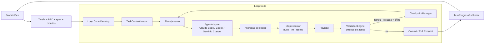

# Loop Code — Arquitetura Proposta

> Data: 2026-07-12 · Complementa `LOOP_CODE_TECHNICAL_ASSESSMENT.md`

## 1. Visão do produto

O **Loop Code** é uma IDE desktop orientada a **workflows de desenvolvimento
com agentes**, conectada ao **Brabrix Dev**. Não é "mais uma IDE com chat de
IA": o conceito central é o **Coding Loop** — receber uma tarefa com contexto,
planejar, implementar com agentes, compilar, testar, revisar, validar critérios
de aceite e devolver o resultado (commit/PR + progresso) ao Brabrix.

```text
Receber tarefa → analisar contexto → criar plano → implementar → compilar
→ testar → revisar → corrigir → validar critérios de aceite
→ commit/pull request → atualizar tarefa no Brabrix
```

O loop repete etapas até: testes passarem, critérios atendidos, limite de
iterações/custo/tempo, necessidade de intervenção humana ou interrupção pelo
usuário.

## 2. Divisão de responsabilidades

| Brabrix Dev (SaaS)                  | Loop Code (desktop)                                |
| ----------------------------------- | -------------------------------------------------- |
| Projetos, backlog, sprints, tarefas | Abrir o projeto local                              |
| PRDs, especificações técnicas       | Receber tarefas e montar contexto para agentes     |
| Critérios de aceite                 | Executar agentes e ciclos de implementação         |
| Contexto do projeto                 | Build, lint, testes, revisão                       |
| Acompanhamento da execução          | Validar critérios, commits/PRs, publicar progresso |

## 3. Componentes propostos (mapeados no código real)

```text
Loop Code Desktop
├── Desktop Shell               (existe)
│   ├── Electron Main           main.js  → fatiar gradualmente p/ electron/*
│   ├── Preload                 preload.js (window.api)
│   └── Renderer                src/ (React + Vite)
│
├── Workspace                   (existe ~100%)
│   ├── Project Manager         projects:* + rail-core.cjs
│   ├── File System             fs:* (local) + remote/remoteFs.cjs (SSH)
│   ├── Terminal                term:*/shell:* + node-pty / sshShell
│   ├── Preview                 preview:* + webview
│   └── Git Manager             git:* (simple-git) → + worktree (Fase 4)
│
├── Agents                      (embrião existe)
│   ├── AgentAdapter            NOVO electron/agents/ — interface formal
│   ├── ClaudeCodeAdapter       sobre chat-cli.cjs (headless stream-json)
│   ├── CodexAdapter            sobre ai-cli.cjs (PTY; headless qdo disponível)
│   ├── GeminiCliAdapter        novo, mesmo molde
│   └── CustomCliAdapter        sobre ai-cli.cjs 'custom'
│
├── Coding Loops                (novo — electron/loop/, padrão "core puro")
│   ├── LoopDefinition          loop-core.cjs (dados + validação, testável)
│   ├── LoopRunner              loop-runner.cjs (máquina de estados)
│   ├── StepExecutor            executa agente/comando/validação por step
│   ├── ValidationEngine        interpreta resultados vs critérios de aceite
│   ├── CheckpointManager       REUSA checkpoint:* (shadow git + lock)
│   └── LoopHistory             persistência de runs/eventos (JSONL)
│
├── Brabrix                     (novo — electron/brabrix/)
│   ├── Authentication          token via safeStorage (reusa secretStore)
│   ├── BrabrixApiClient        REST (fetch no main); MCP como alternativa
│   ├── TaskContextLoader       tarefa+spec+critérios → prompt de contexto
│   ├── TaskProgressPublisher   eventos do loop → API Brabrix
│   └── DeepLinkHandler         protocolo loopcode:// (abrir tarefa/projeto)
│
└── Persistence
    ├── Settings                userData/config.json (existe; versionar schema)
    ├── Projects                config.json projects[] + <projeto>/.carcara/*
    ├── AgentSessions           claude-sessions.cjs + sessionMeta (existe)
    ├── LoopRuns                NOVO userData/loops/<runId>.json
    └── Events                  NOVO userData/loops/<runId>.events.jsonl
```

Princípios:

1. **Não impor a estrutura** — cada componente novo nasce como módulo em
   `electron/` seguindo o padrão existente (lógica pura `.cjs` testável +
   efeitos no main), e os existentes são _promovidos_, não reescritos.
2. **IPC como fronteira**: o renderer permanece burro em relação ao loop; a
   máquina de estados vive no main (sobrevive a re-render e permite headless
   futuro).
3. **Aditivo**: nenhuma funcionalidade atual (chat, preview, git, MCP) é
   removida; o Coding Loop é um painel/modo a mais.

## 4. Fluxo de uma tarefa (Brabrix → Loop Code → Brabrix)

1. Usuário seleciona a tarefa (deep link `loopcode://task/<id>` ou UI).
2. `TaskContextLoader` busca no Brabrix: descrição, PRD, spec, critérios de
   aceite, contexto do projeto — e resolve o projeto local correspondente.
3. Loop Code monta o **pacote de contexto** (arquivos + prompt) e inicia um
   `CodingLoopRun` com a `LoopDefinition` escolhida.
4. Durante a execução, `TaskProgressPublisher` envia eventos (step, iteração,
   custo, resultado de testes) para o Brabrix.
5. Ao final: commit/PR criado, critérios validados, tarefa atualizada
   (concluída, bloqueada ou aguardando revisão humana).

## 5. Fluxo de um Coding Loop (máquina de estados)

```text
idle → planning → executing(step) → validating → [ok] → committing → reporting → done
                        ↑               │
                        └── correcting ←┘ [falhou e iteration < limits.maxIterations]
qualquer estado → paused (usuário) | needs_human (agente/validação pede) | canceled | failed
```

- Cada **step** declara tipo (`agent`, `command`, `validation`, `review`),
  entrada, política de retry e critério de sucesso.
- Antes de cada iteração o `CheckpointManager` cria um checkpoint no shadow
  git; `correcting` pode restaurar o último checkpoint bom.
- Toda transição vira um evento em `LoopHistory` (JSONL) e um push IPC
  `loop:event` para a UI (mesmo padrão de `chat:event`/`todos:snapshot`).

## 6. Estratégia de agentes

- **Interface única** (`CodingAgentAdapter`, ver `docs/contracts/`), com duas
  capacidades de transporte:
  - `headless` — processo `spawn` com protocolo estruturado (Claude Code:
    `-p --input-format/--output-format stream-json`, já implementado em
    `chat-cli.cjs`). É o modo preferido do LoopRunner (parseável: custo,
    ferramentas, resultado).
  - `pty` — terminal interativo (já implementado via `term:ensure`), fallback
    universal para CLIs sem modo headless (modo "assistido").
- `ai-cli.cjs` continua sendo a fonte de verdade de ids/resume/custom; os
  adapters o encapsulam em vez de substituí-lo.
- Detecção de disponibilidade reusa `system:checkTools`.
- Permissões: o modo `bypassPermissions` atual vira **política por loop**
  (`limits`/`policy`), nunca mais um default global escondido.

## 7. Estratégia de Git

- Curto prazo (Fase 3): loop roda na branch atual; commits do loop são
  explícitos e rotulados; shadow-checkpoints protegem entre iterações.
- Fase 4: cada run cria **branch dedicada** (`loop/<taskId>-<slug>`) e,
  preferencialmente, **worktree** separada (`git worktree add`) para não
  disputar o working copy com o usuário — simple-git suporta via `raw()`.
- PR fica na Fase 5+ (via `gh` CLI ou API do provedor), nunca `push`
  automático sem ação do usuário.

## 8. Estratégia de persistência

- `config.json` ganha `configVersion` e migrações explícitas (hoje são
  ad-hoc em `loadConfig`).
- Dados por projeto seguem em `<projeto>/.carcara/` → renomear para
  `.loopcode/` com fallback de leitura (Fase 1).
- Runs e eventos de loop: `userData/loops/` — um JSON de estado por run +
  JSONL de eventos (append-only, barato e auditável). Migrar para SQLite só
  se o volume justificar.
- Segredos (token Brabrix, SSH): sempre `safeStorage` (padrão já existente em
  `remote/secretStore.cjs`), nunca em `config.json`.

## 9. Estratégia de segurança

- Manter `contextIsolation: true` / `nodeIntegration: false`; preload continua
  sendo a única ponte.
- Novos canais IPC do loop validam entrada no main (paths dentro do projeto,
  ids conhecidos) — o renderer nunca passa comandos shell crus para o loop.
- Execução autônoma: limites obrigatórios (iterações, tempo, custo) e
  escalonamento para `needs_human` em ações destrutivas.
- Token Brabrix em `safeStorage`; nenhum segredo em logs/eventos JSONL.
- Deep links (`loopcode://`) validados e confirmados com o usuário antes de
  abrir projeto/rodar loop.

## 10. Diagrama



## 11. Contratos iniciais

Os contratos TypeScript propostos (AgentAdapter, LoopDefinition, LoopRun,
ValidationResult e eventos) estão em
[`docs/contracts/loop-code-contracts.ts`](contracts/loop-code-contracts.ts) —
arquivo apenas de referência, sem efeito no runtime atual (o projeto é JS).
Eles servirão de guia quando os módulos `electron/agents/` e `electron/loop/`
forem criados (Fases 2–3 do plano de migração).
